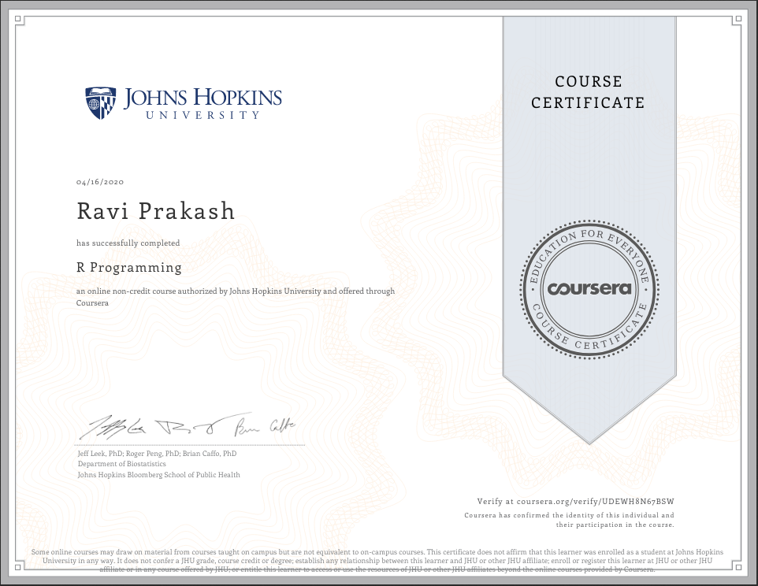

## R Programming

1. It is a crash course to the R programming language.
2. It covers all the most important thing and informations which is required to begin with the Data Analysis in R.

The things covered in the following 4 weeks are:
> * Overview of R, R data types and objects, reading and writing data
> * Control structures, functions, scoping rules, dates and times
> * Loop functions, debugging tools
> * Simulation, code profiling

Here I've tried to keep all the things kinda notes, learnt during this course.

### Certificate earned:

A book, called [_R Programming for Data Science_](http://leanpub.com/rprogramming?utm_source=coursera&utm_medium=CourseraEmail&utm_campaign=Coursera) is also recommanded to learn the R language, from scratch. 
This book is also available on the [_Lulu_](http://www.lulu.com/shop/roger-peng/r-programming-for-data-science/paperback/product-22280814.html).

 

**Links to the NOTES:**
* [Week 1](week1)
* [Week 2](week2)
* [Week 3](week3)
* [Week 4](week4)

[_Back to Home_](../)
